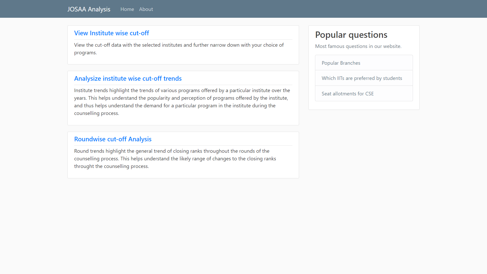
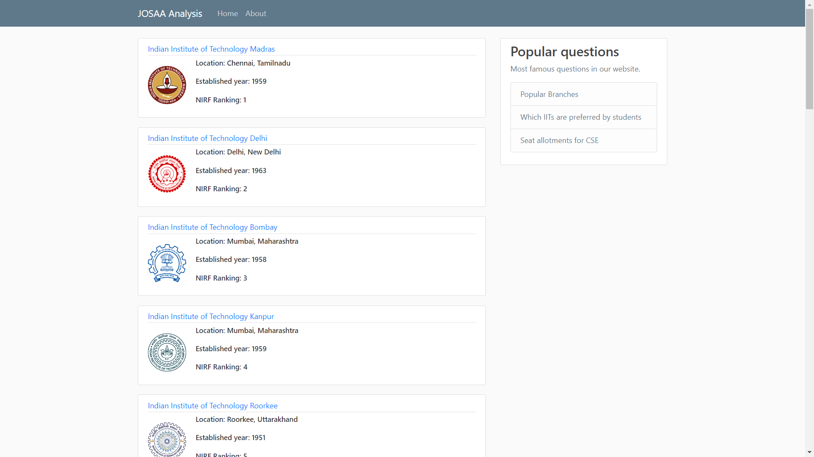
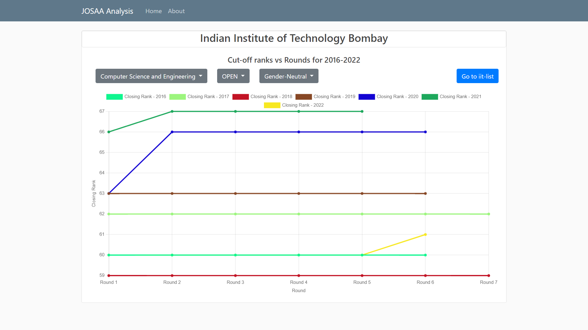
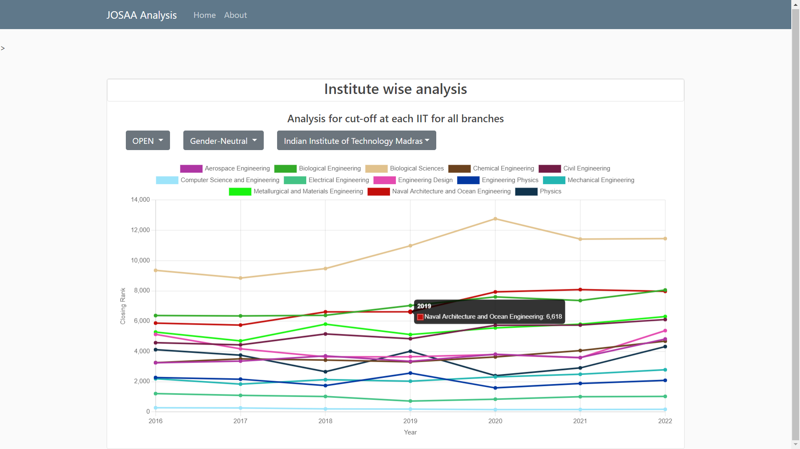

# JOSAA-data-analysis
This project aims to create a portal that allows users to explore the seat allotment statistics of JOSAA (Joint Seat Allocation Authority) from 2016 to 2022. The project involves web scraping data from the JOSAA website, performing data cleaning and analysis, and presenting the insights through visualizations on a website frontend. The website presents the findings through interactive charts and tables, enabling users to gain valuable insights into the trends and patterns of seat allotments over the years.

## Tech Stack/Frameworks:
- Frontend: HTML, CSS, JavaScript
* Backend: Django
+ Database: SQLite
- Data Scraping: Beautiful Soup
* Data Cleaning: NumPy, Pandas
+ Data Visualization: Chart.js

## Command to run the project locally
- python manage.py runserver
- Then run the server locally on port 8000

## Home page
The home page of the JOSAA Analysis portal provides a user-friendly interface to explore and analyze the JOSAA seat allotment statistics. It offers several insightful sections to delve into the data and gain valuable information. Here's a breakdown of each section:
- View Institute wise cut-off
- Analyze institute wise cut-off trends
- Roundwise cut-off Analysis 

- 

## View Institute wise cut-off list page
- Upon clicking this option, a list of all IITs is shown along with their NIRF ranking(2023), Location and their established year. So the users can select specific institutes and explore the corresponding cut-off data.
- 
 
  - ### For each IIT
      - By selecting a specific IIT, users can explore the trends and changes in the cut-off ranks throughout the various rounds of the seat allocation process over the years 2016 to 2022.
      - It can further narrow down their search by choosing specific programs offered by the selected institutes along with seat type and gender.
      - This feature helps users understand the cut-off trends for different programs in their preferred institutes.
      - 

## Analyze institute wise cut-off trends
- Institute trends highlight the trends of various programs offered by a particular institute over the years. This helps understand the popularity and perception of programs offered by the institute, and thus helps understand the demand for a particular program in the institute during the counselling process.
- 
  
- Upon sleecting the gender, branch and institute, user will get the cut-off analysis for each branch present at that IIT.

- 

## Roundwise cut-off Analysis
- Round trends highlight the general trend of closing ranks throughout the rounds of the counselling process. This helps understand the likely range of changes to the closing ranks throught the counselling proces.
- Users can get the round wise analysis at each IIT by selecting the gender,seat type and branch. 
- User can change the college name by clicking on "Go to iit-list" buttion.
- 

# JOSAA_Analysis
